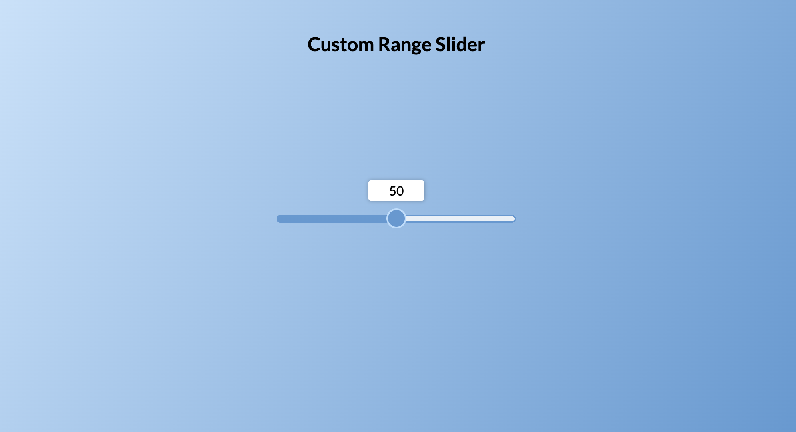

# Custom Range Slider



A beautifully designed and interactive custom range slider built with HTML, CSS, and JavaScript. This project demonstrates how to style a range input element, display dynamic values, and implement a smooth background gradient effect based on the slider's position. It’s a great starting point for enhancing user experience in forms and interactive applications.

## Key Features
- **Dynamic Label Positioning**: The label dynamically adjusts its position above the slider to follow the thumb as it moves.
- **Background Gradient Effect**: The slider's background fills with a gradient as the value increases.
- **Custom Thumb Design**: The slider thumb is styled for a sleek and modern look.
- **Responsive Design**: Works seamlessly across various devices and screen sizes.

## Technologies Used
- **Frontend**: HTML, CSS (with custom styling for the slider and thumb).
- **JavaScript**: Handles dynamic label positioning and gradient updates.

## How to Run
1. Clone the repository:
   ```bash
   git clone https://github.com/yourusername/Custom-Range-Slider.git
   cd Custom-Range-Slider
   ```
2. Open `index.html` in your browser to see the slider in action.

## Live Demo
Check out the live demo [here](https://chrisroland.github.io/Custom-Range-Slider/)

## Contributions
- Feel free to **open issues** for bugs or feature requests.
- **Pull requests** are welcome for enhancements or new features.
- This project is **open-sourced**, and I welcome **constructive feedback** and **collaborations**!

Thank you for exploring this project! ❤️